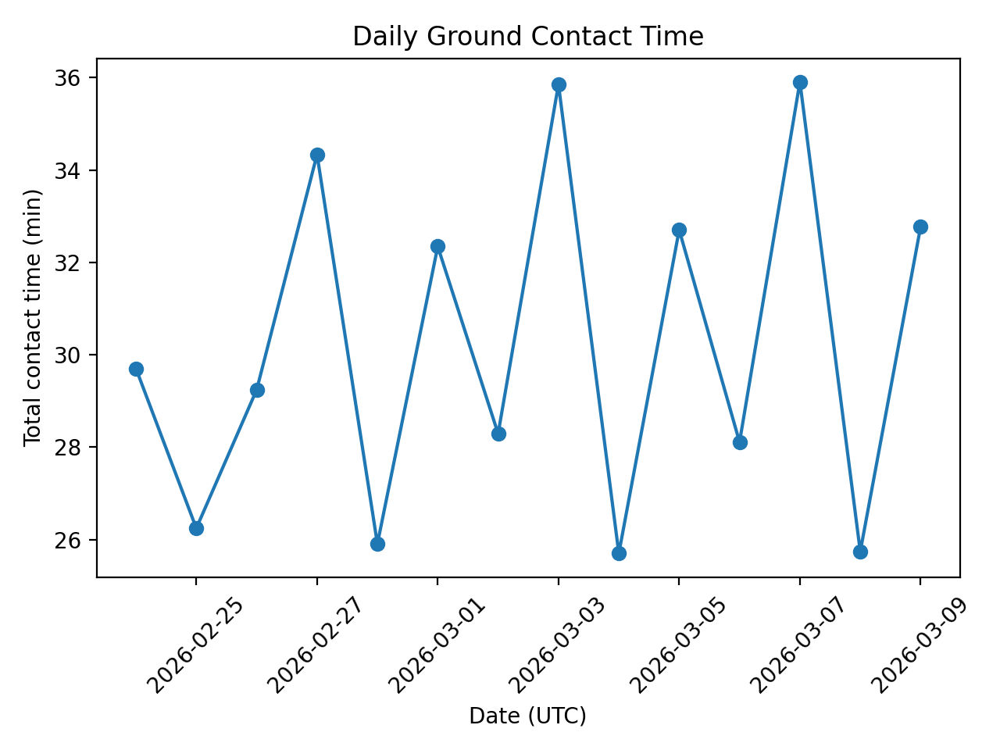
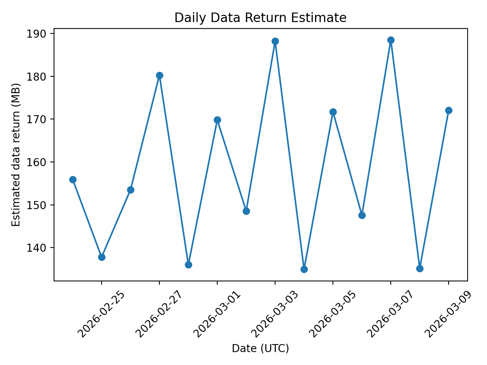

# Ground Contact & Data Return Analysis Tool (Python)

A small **mission-operations style** analysis tool to estimate **ground-station contact windows** and **data-return opportunity** from orbital inputs (TLE/SGP4). It produces pass-level KPIs (AOS/LOS, duration, max elevation) and daily summaries for quick trade studies.

## What it does
- Computes passes above a configurable **mask angle**
- Extracts pass KPIs: **AOS/LOS**, duration, **max elevation**
- Estimates data return using a simple placeholder model:  
  `data_return ≈ duration × downlink_rate × efficiency`
- Exports results as **CSV** and generates two plots:
  - daily contact time
  - daily estimated data return

## Configuration used (example)
- Ground station: **Darmstadt** (49.8728°N, 8.6512°E, 144 m)
- Mask angle: **10°**
- Minimum pass duration: **120 s**
- Downlink: **1.0 Mbps**, efficiency **0.70**
- TLE source: **CelesTrak** (live URL)

## Repository structure
- `run_passes.py` — main script
- `config.yml` — configuration (time window, satellite, ground station, link assumptions)
- `requirements.txt` — Python dependencies
- `outputs_mask10/` — example outputs (generated)

## Quickstart
Create a virtual environment, install dependencies, run the analysis:

python3 -m venv .venv
source .venv/bin/activate
pip install -r requirements.txt
python3 run_passes.py outputs_mask10

## Outputs
After running, the output folder contains:
- `outputs_mask10/passes.csv` — pass list with KPIs
- `outputs_mask10/daily_summary.csv` — daily aggregates
- `outputs_mask10/daily_contact_time.png` — plot of daily contact time
- `outputs_mask10/daily_data_return.png` — plot of daily estimated data return

## Example Outputs

## Notes / assumptions
- Orbit propagation uses **SGP4** with **TLE** inputs.
- A pass is defined as satellite elevation ≥ `mask_deg`.
- The data-return calculation is a simplified constant-rate estimate (useful for first-order sizing).

## References
- Skyfield Earth satellite documentation: https://rhodesmill.org/skyfield/earth-satellites.html
- CelesTrak TLE data source: https://celestrak.org/
